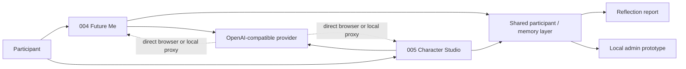

# AI-Uni

> Two focused AI experiences for AI-Ques: **004 Future Me** and **005 Character Studio**.

[Architecture](docs/ARCHITECTURE.md) · [Agent handoff](HANDOFF.md) · [Status](STATUS.md) · [Decisions](DECISIONS.md) · [TODO](TODO.md)

AI-Uni is a lightweight, browser-first prototype for creating and talking with a possible future self, or creating an original AI character and chatting with it. It keeps user data locally by default and can connect to an OpenAI-compatible text/image endpoint such as a local FreeLLM API.

## Architecture at a glance



The browser MVP is intentionally local-first. Production research use requires authenticated server-side identity, storage, consent, access control and auditability.

## Modules

### 004 · Future Me

[Module notes](apps/004-future-me/README.md)

- collect the user's current self, goals, values and important experiences
- generate a **possible future self** (not a prediction)
- optionally generate a future-self image
- chat with the future self
- browser TTS via `speechSynthesis`
- preserve conversations for later analysis

### 005 · Character Studio

[Module notes](apps/005-character-studio/README.md)

- user starts from their own idea instead of choosing a preset character
- AI expands the idea into a structured character/persona
- optionally generate an original character image
- chat with the created character
- preserve character and conversation history

### Shared analysis

AI-Uni can synthesize saved user input and conversations into a structured reflection report covering personality patterns, strengths, limitations, self-model, relationship patterns, growth suggestions, and carefully worded **non-diagnostic** trauma-related / unusual-experience signals.

A core rule is that fictional character content must not be treated as autobiographical or psychiatric evidence about the participant.

## Run

This first version is deliberately build-free:

```bash
python -m http.server 8080
```

Then open `http://localhost:8080`.

Without an API, the interface and local data flow still work; AI-generation actions use local fallback content.

## Connect FreeLLM / another OpenAI-compatible endpoint

### Direct browser mode

Open **Settings** and enter:

- API Base, e.g. `http://127.0.0.1:8000/v1`
- text model name
- image model name
- API key if needed

The upstream service must permit browser CORS.

### Local proxy mode

If direct browser requests fail because of CORS, or you do not want an upstream key stored in browser localStorage:

```bash
pip install -r proxy/requirements.txt

# macOS/Linux example
export UPSTREAM_API_BASE=http://127.0.0.1:8000/v1
export UPSTREAM_API_KEY=

uvicorn proxy.server:app --host 127.0.0.1 --port 8787
```

Then set the web app API Base to:

```
http://127.0.0.1:8787/v1
```

and leave the browser API key blank.

## Data & privacy

- Prototype data is stored in the current browser's `localStorage`.
- Multiple participant profiles are separated by participant code.
- The admin view is a **local research prototype**, not a secure production authorization boundary.
- Do not deploy sensitive research/clinical data publicly without replacing localStorage/admin controls with authenticated server-side storage and access control.
- Psychological outputs are signals for reflection/research support, not diagnosis.

## Repository map

```
index.html / styles.css / app.js   browser MVP
apps/004-future-me/               004 product boundary
apps/005-character-studio/        005 product boundary
proxy/                            optional local model proxy
schemas/                          shared data contracts
docs/                             architecture
STATUS.md                         canonical current state
DECISIONS.md                      frozen product decisions
TODO.md                           execution queue
```

## Validation

Current CI is intentionally narrow:

```bash
node --check app.js
python -m py_compile proxy/server.py
```

For product behavior changes, also run the local server and exercise the affected 004/005 path manually until browser/runtime regression tests are added.

## Agent continuity

Cold-start order:

```text
AGENTS.md
→ HANDOFF.md
→ STATUS.md
→ DECISIONS.md
→ TODO.md
→ docs/ARCHITECTURE.md
→ affected module files
```

Git is the durable source of truth; chat history is not canonical.

## Project state

See [STATUS.md](STATUS.md), [DECISIONS.md](DECISIONS.md), and [TODO.md](TODO.md).

## Scope

AI-Uni intentionally does **not** contain the old life-simulation / AI-Town game loop. This repository focuses on 004 and 005 plus their shared user, memory, analysis and admin shell.
